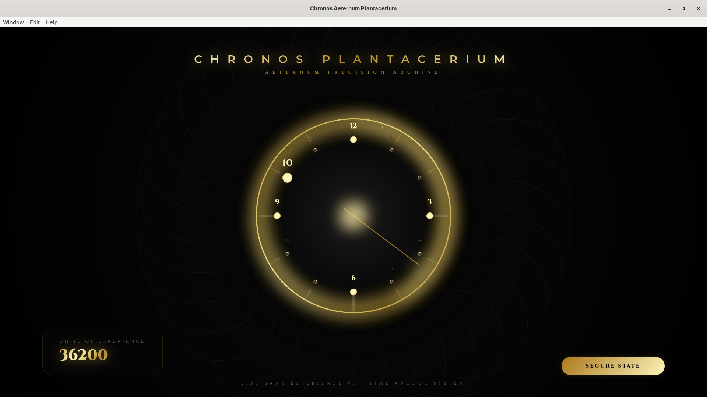

# ⚜️ CHRONOS PLANTACERIUM ⚜️
### *Aeternum Precision Archive — Time Experience Snapshots.*

[](https://www.rust-lang.org/)
[](https://dioxuslabs.com/)
[]()

**Chronos Aeternum Plantacerium** is a sacred horological instrument designed to transform the ephemeral passage of time into a permanent inventory of human experience. Drawing inspiration from celestial mechanics and high-jewelry precision, it provides a meditative interface for anchoring your consciousness in the void.


## Time Observer Interface

---

## 🌌 The Celestial Instrument

The application features the **Vault of Flow**, a centered chronometric interface designed for maximum visual focus.

- **Celestial Spirit Dot**: A radiant golden beacon that orbits the timepiece, indicating the exact minute within the current hour.
- **360° Aether Ring**: A solid, continuous golden aura that bathes the entire circumference in a meditative "breathing" light.
- **Experience Accumulator**: Every second lived is banked as a "Unit of Experience," displayed in a sleek glassmorphic panel.
- **Dual-Direction Emanation**: Concentric energy rings that expand and contract from the core, visually representing the breath of time.
- **Precision Ticks**: Bold quadrant anchors (12, 3, 6, 9) provide geometric stability within the luminous void.

---

## 📜 Mastery of Memory (Temporal Archiving)

Chronos Plantacerium features a high-fidelity **Temporal Observation Node** system.

1. **Focus**: Click any hour marker (1-12) to open the memory vault for that specific celestial position.
2. **Record**: Write your insights in rich **Markdown**. No detail is too small for the archive.
3. **Persist**: Observations are secured using a **Full Date-Hour Key** (YYYY-MM-DD-HH), allowing for infinite historical persistence across days and years.
4. **Vault Protection**: Entries are automatically saved to `chronos_notes.json`. Use the **"Secure State"** button to manually verify the integrity of the temporal vault.

---

## 🛠 Tech Stack of the Ancients

- **Core**: [Rust](https://rust-lang.org) (The language of immutable reliability).
- **UI Architecture**: [Dioxus](https://dioxuslabs.com) (Declarative high-performance UI).
- **Temporal Logic**: [Chrono](https://github.com/chronotope/chrono) for relativistic precision.
- **State Persistence**: [Serde](https://serde.rs) & JSON for robust historical tracking.
- **Visual Design**: Vanilla CSS with SVG Filters, Gaussian Glows, and Glassmorphism.

---

## 🗝 Installation

Ensure you have the Rust toolchain installed.

```bash
# Clone the vault
git clone https://github.com/plantacerium/ChronosAeternum

# Enter the void
cd ChronosAeternum

# Invoke the watch
cargo run
```

---

## 🕯 Philosophy

> "Time is not a resource to be spent, but a canvas to be filled. Chronos Plantacerium is the archive of that filling."

In the noise of the modern world, we often lose the 'weight' of our hours. By saving our experiences with date-hour precision, we turn the ephemeral into the eternal.

---

*Designed for the elite observer. Built with precision in Rust.*
